<div align="center">

# 🗣️ WorkerVoice

### *Empowering Myanmar Migrant Workers Through Shared Experience*

[](https://nextjs.org/)
[](https://react.dev/)
[](https://www.typescriptlang.org/)
[](https://www.prisma.io/)
[](https://tailwindcss.com/)
[](https://www.postgresql.org/)

---

**WorkerVoice** is a workplace review platform that helps Myanmar migrant workers make **safer employment decisions** before joining a company or recruitment agency.

Workers can anonymously review factories, companies, and recruitment agencies — sharing real experiences to protect their community.

[✨ Features](#-features) • [🚀 Quick Start](#-quick-start) • [📖 Documentation](#-documentation) • [🛠️ Tech Stack](#️-technology-stack)

---

</div>

## 🌟 Features

<div align="center">

| Feature | Description |
|:---------|:------------|
| 🔍 **Company Search** | Search factories and agencies by location, size, and activity |
| 📋 **Company Detail** | View detailed information, ratings, and reviews |
| ✍️ **Anonymous Reviews** | Submit workplace reviews — your identity stays safe |
| 👍 **Voting System** | Vote reviews as **Useful** or **Not Useful** |
| 🏢 **Agency Detail** | Research recruitment agencies before signing up |
| 🤖 **Telegram Bot** | [Search and browse directly from Telegram](https://t.me/workervoice69_bot) |

</div>

---

## 👀 Preview

<div align="center">
  <table>
    <tr>
      <td colspan="3" align="center"><strong>🌐 Public Pages</strong></td>
    </tr>
    <tr>
      <td align="center">
        <strong>🏠 Homepage</strong><br />
        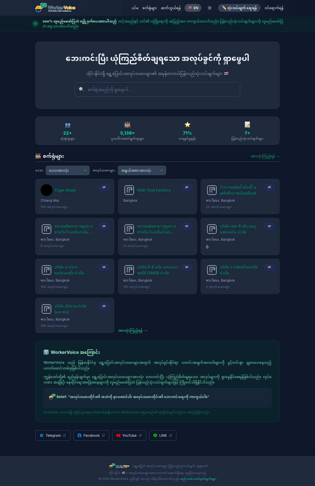
      </td>
      <td align="center">
        <strong>🔑 User Login</strong><br />
        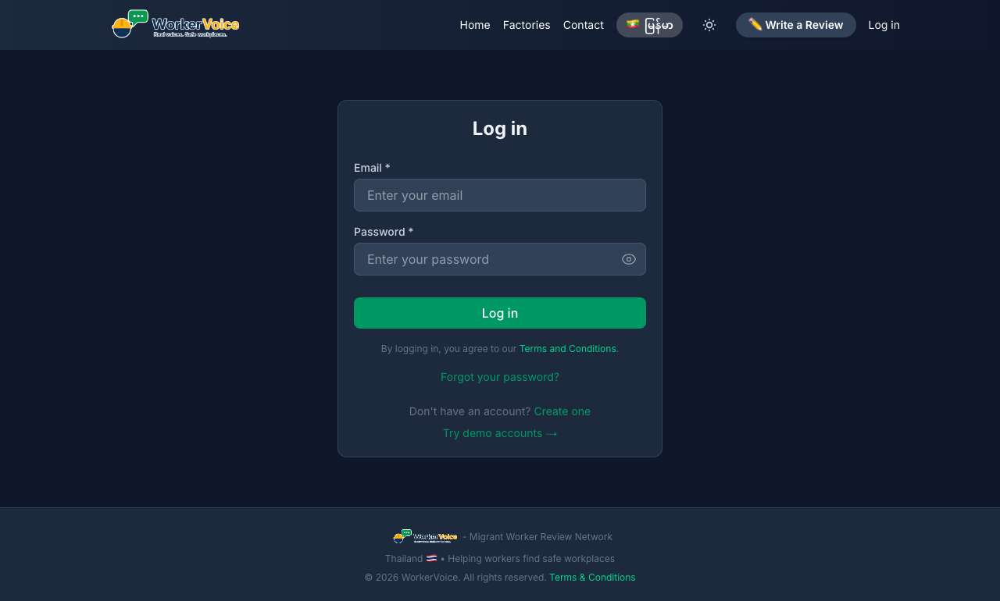
      </td>
      <td align="center">
        <strong>👤 User Profile</strong><br />
        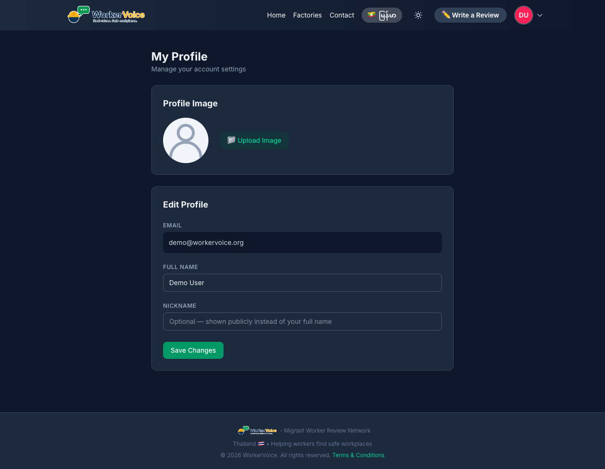
      </td>
    </tr>
    <tr>
      <td align="center">
        <strong>🏭 Factory Detail</strong><br />
        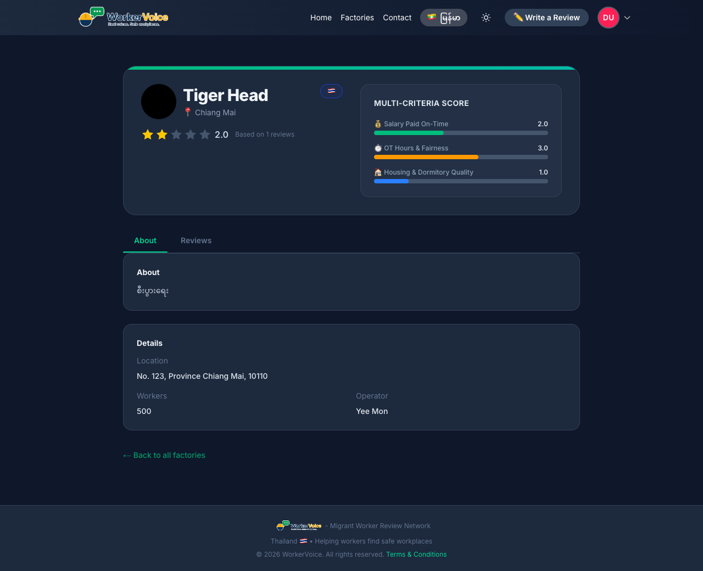
      </td>
      <td align="center">
        <strong>🏭 My Factories</strong><br />
        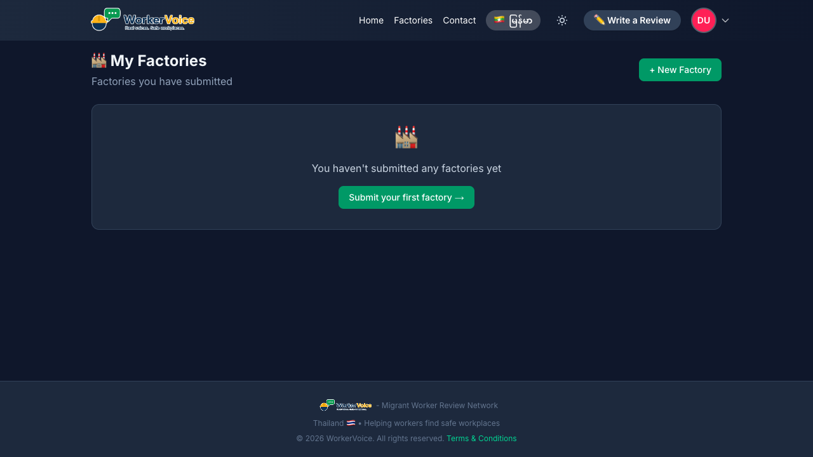
      </td>
      <td align="center">
        <strong>✍️ Write a Review</strong><br />
        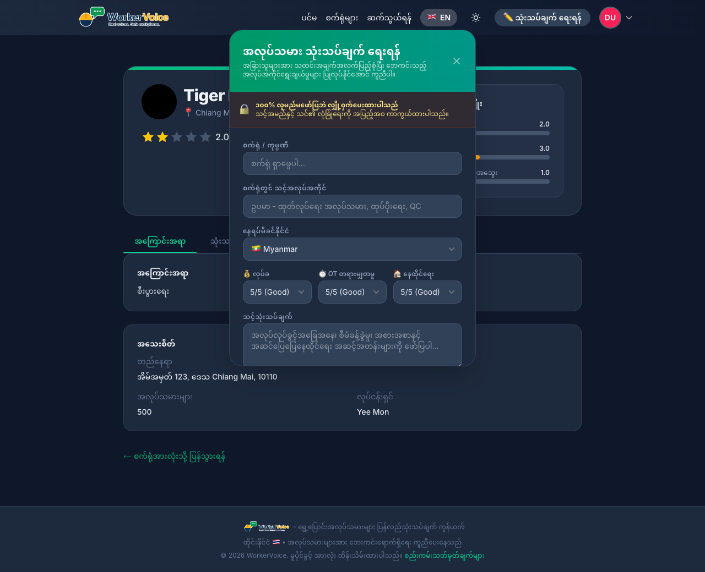
      </td>
    </tr>
    <tr>
      <td colspan="3" align="center"><strong>🔐 Admin Panel</strong></td>
    </tr>
    <tr>
      <td align="center">
        <strong>🔑 Login</strong><br />
        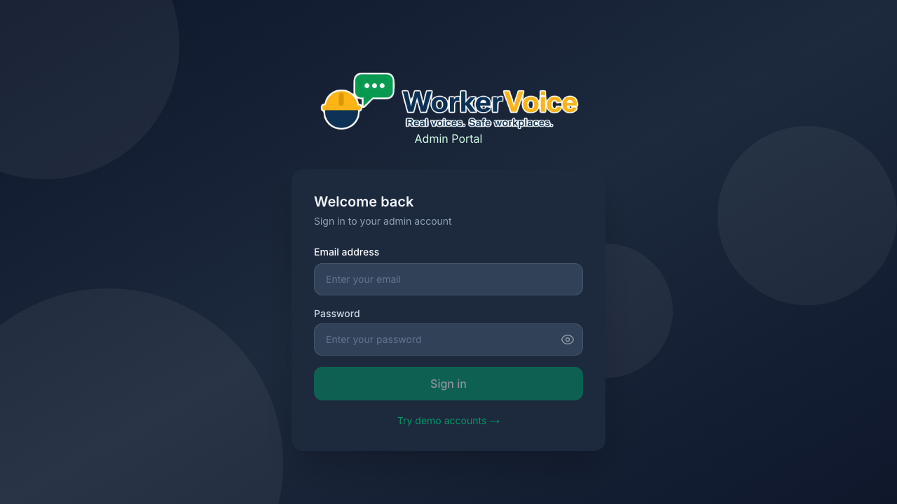
      </td>
      <td align="center">
        <strong>📊 Dashboard</strong><br />
        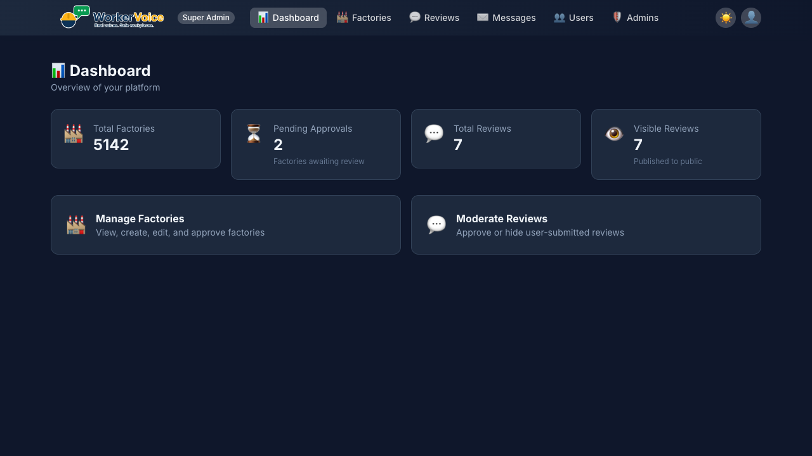
      </td>
      <td align="center">
        <strong>🏭 Factories</strong><br />
        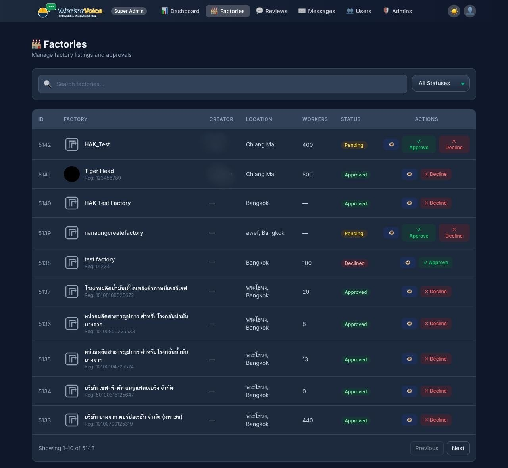
      </td>
    </tr>
    <tr>
      <td align="center">
        <strong>📝 Reviews</strong><br />
        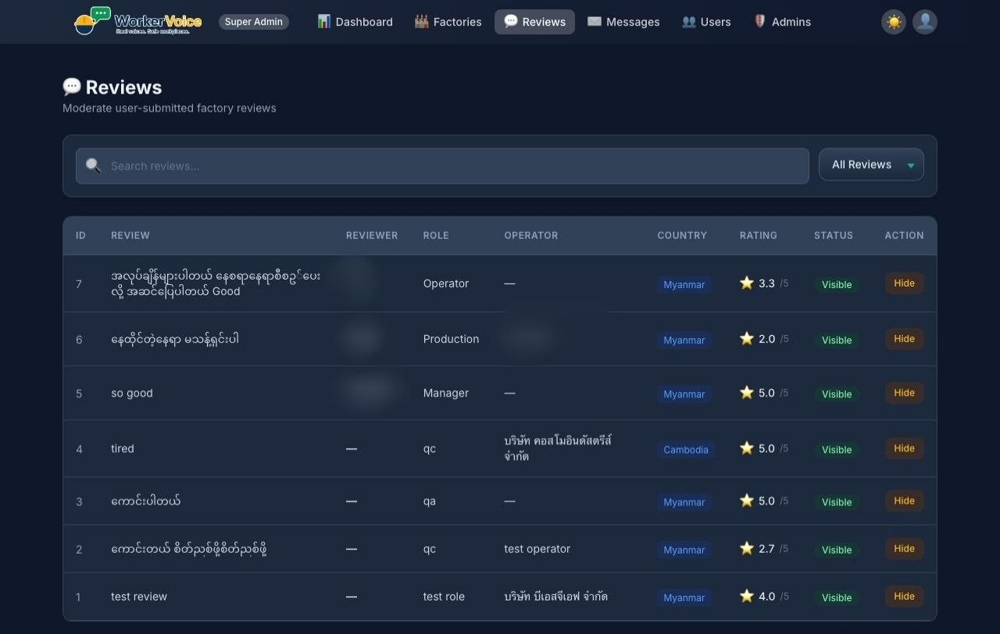
      </td>
      <td align="center">
        <strong>👥 Users</strong><br />
        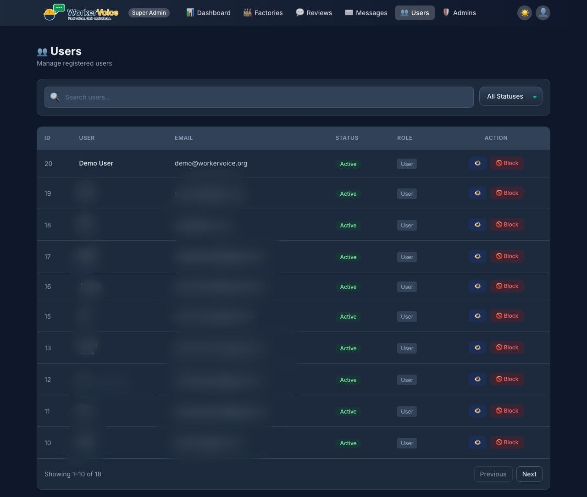
      </td>
      <td align="center">
        <strong>📬 Contacts</strong><br />
        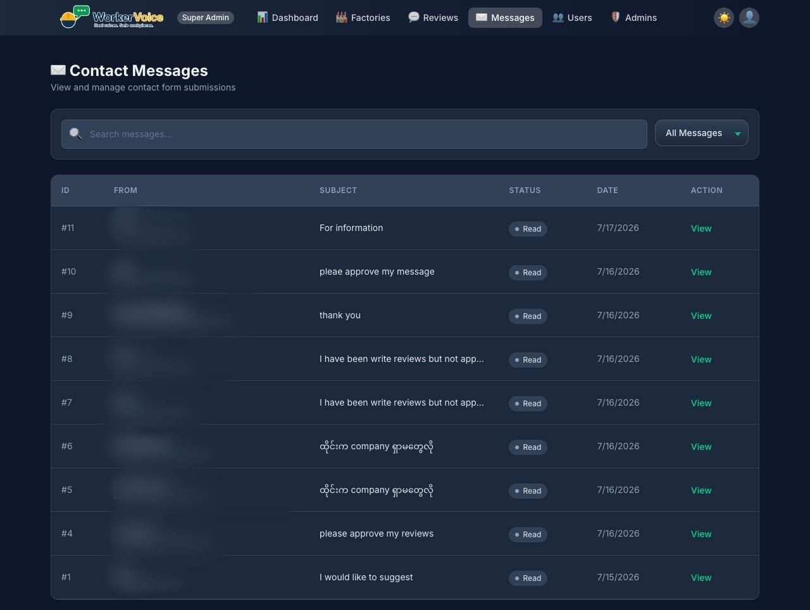
      </td>
    </tr>
    <tr>
      <td align="center">
        <strong>👤 Profile</strong><br />
        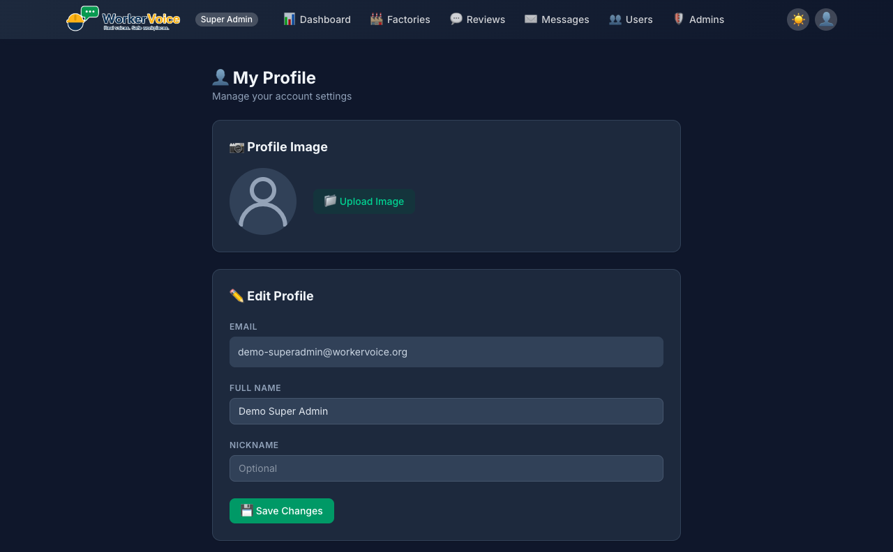
      </td>
      <td align="center">
        <strong>🔐 Admins</strong><br />
        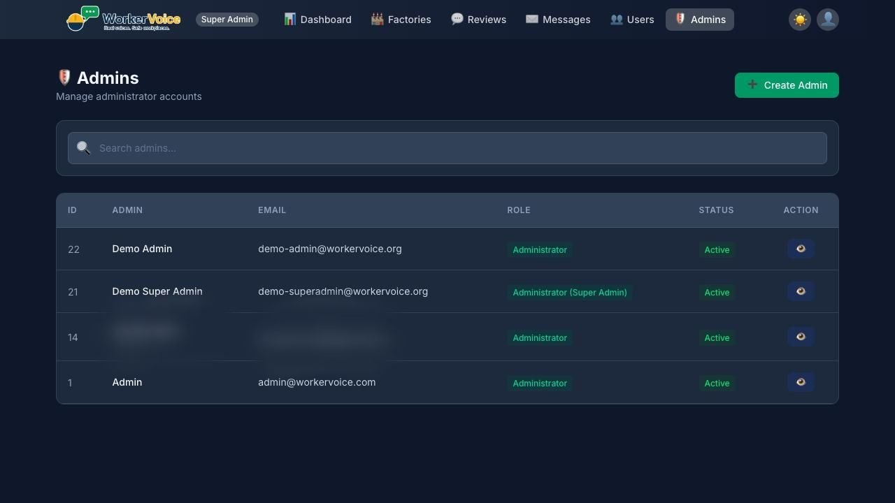
      </td>
      <td align="center">
        <strong>🔄 Change Password</strong><br />
        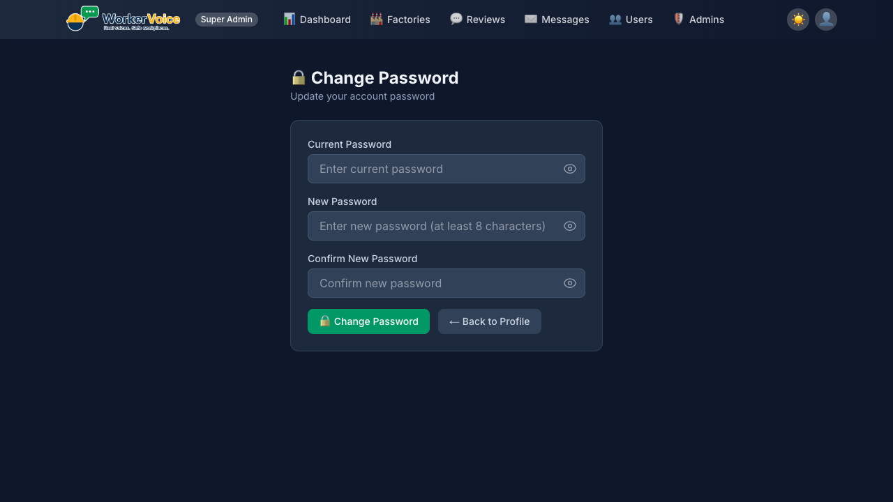
      </td>
    </tr>
  </table>
</div>

---

## 🧪 Demo

Explore WorkerVoice without signing up — use our demo accounts to test all features.

| Demo Page | Description |
|:----------|:------------|
| 🏠 [Public Demo](/demo) — [workervoice.help](https://workervoice.help) | Browse factories, read reviews, try the user experience |
| 🔐 [Admin Demo](/admin/demo) — [workervoice.help/admin](https://workervoice.help/admin) | Explore the admin dashboard, manage content and users |

> 📖 **Full demo guide available** — See [DEMO.md](DEMO.md) for detailed walkthroughs, testing scenarios, and account information for all roles.

**Demo credentials:** All accounts use password `Demo1234!`

| Account | Email / Link | Role |
|:--------|:-------------|:-----|
| 👤 User | `demo@workervoice.org` | Browse & review |
| 🟣 Super Admin | `demo-superadmin@workervoice.org` | Full admin access |
| 🔵 Admin | `demo-admin@workervoice.org` | Content management |
| 🤖 Telegram Bot | [t.me/workervoice69_bot](https://t.me/workervoice69_bot) | Search & browse on Telegram |

---

## 🚀 Quick Start

### 📋 Prerequisites

| Option | Requirements |
|:-------|:-------------|
| **🐳 Docker (Recommended)** | [Docker Desktop](https://www.docker.com/products/docker-desktop/) installed and running |
| **💻 Host + Docker DB** | Node.js 24.x, npm 11.x, Docker Desktop |

### 🐳 One-Click Setup (Docker)

```bash
# 1. Clone & enter
git clone <repository-url>
cd team-14-app

# 2. Configure environment
cp .env.example .env

# 3. Launch everything
docker compose up -d

# 4. Open in browser
open http://localhost:3000
```

**That's it!** The stack starts three containers automatically:

| Container | Role |
|:----------|:-----|
| `migrant-review-app` | Next.js dev server with hot reload |
| `migrant-review-postgres` | PostgreSQL 16 database |
| `migrant-review-migrate` | Applies schema migrations, then exits |

### 💻 Host + Docker Setup

```bash
# 1. Clone & install
git clone <repository-url>
cd team-14-app
npm install

# 2. Configure environment
cp .env.example .env

# 3. Start database only
docker compose up -d postgres

# 4. Prepare database
npx prisma generate
npx prisma migrate dev

# 5. Start dev server
npm run dev

# 6. Open in browser
open http://localhost:3000
```

### ✅ Verify It's Working

```bash
# All services should be Up
docker compose ps

# Or check the app responds
curl -I http://localhost:3000
# → HTTP/1.1 200 OK
```

---

## 🛠️ Technology Stack

<div align="center">

| Component | Version | Purpose |
|:----------|:--------|:--------|
|  | 24.16.x | Runtime |
|  | 16.2.x | Web framework |
|  | 19.2.x | UI library |
|  | 5.9.x | Type safety |
|  | 7.8.x | ORM |
|  | 4.3.x | Styling |
|  | 16 | Database |
|  | 9.x | Linting |
|  | 4.1.x | Unit testing |
|  | 1.61.x | E2E testing |

</div>

---

## 📁 Project Structure

```
📦 team-14-app
├── 📄 app/                    # Next.js App Router
│   ├── 🌐 api/               # Route handlers
│   ├── 📄 layout.tsx         # Root layout
│   └── 📄 page.tsx           # Home page
├── 📦 src/
│   ├── 🧩 components/        # Reusable UI components
│   ├── 🏷️ types/             # TypeScript type definitions
│   └── ⚙️ generated/         # Prisma generated client
├── 📚 lib/
│   ├── 🔗 prisma.ts          # Prisma client singleton
│   ├── 🏭 factories.ts       # Factory service
│   ├── 📝 reviews.ts         # Review service
│   ├── 💡 suggestions.ts     # Suggestion service
│   └── 🔐 admin.ts           # Admin authentication
├── 🗄️ prisma/
│   ├── 📐 schema.prisma      # Database schema
│   └── 📁 migrations/        # Database migrations
├── 📖 docs/                  # Documentation
└── 🖼️ public/                # Static assets
```

---

## 📋 Environment Variables

Copy `.env.example` to `.env` and adjust as needed.

| Variable | Description | Required |
|:---------|:------------|:--------:|
| `POSTGRES_USER` | PostgreSQL username | ✅ |
| `POSTGRES_PASSWORD` | PostgreSQL password | ✅ |
| `POSTGRES_DB` | PostgreSQL database name | ✅ |
| `DATABASE_URL` | Prisma connection string | ✅ |
| `NEXT_PUBLIC_API_URL` | Frontend API base URL | ✅ |
| `ADMIN_KEY` | Admin authentication key | ✅ |

> ⚠️ Never commit `.env` — it's git-ignored. Only `.env.example` (with placeholder values) is committed.

---

## 🐳 Docker Commands

| Command | What It Does |
|:--------|:-------------|
| `docker compose up -d` | Start full stack (app + DB) |
| `docker compose up -d postgres` | Start database only |
| `docker compose up -d --build` | Rebuild images & start |
| `docker compose down` | Stop & remove containers |
| `docker compose down -v` | Full reset (wipes data) |
| `docker compose logs -f app` | Follow app logs |
| `docker compose logs -f postgres` | Follow database logs |
| `docker compose ps` | Check service status |

---

## 🗄️ Prisma Commands

| Command | What It Does |
|:--------|:-------------|
| `npx prisma generate` | Regenerate Prisma client |
| `npx prisma migrate dev` | Apply pending migrations |
| `npx prisma migrate status` | Check migration status |
| `npx prisma studio` | Open database browser GUI |

---

## 🧪 Testing

```bash
# Unit & integration tests
npm run test          # Watch mode
npm run test:run      # Single run
npm run test:coverage # With coverage report

# End-to-end tests
npm run test:e2e      # Playwright E2E
```

---

## 💻 Development Commands

| Command | What It Does |
|:--------|:-------------|
| `npm run dev` | Start development server (Turbopack) |
| `npm run build` | Build for production |
| `npm run start` | Start production server |
| `npm run lint` | Run ESLint |
| `npm run format` | Format code with Prettier |
| `npm run type-check` | Run TypeScript type checking |

---

## 🚢 Deployment

### ▲ Vercel (Recommended)

1. Push to GitHub
2. Import project in [Vercel](https://vercel.com/)
3. Configure environment variables
4. Deploy ✨

### 🐳 Docker

1. Build the Docker image
2. Configure environment variables
3. Run with Docker Compose on your server

---

## 🗺️ Roadmap

<div align="center">

| Sprint 1 | Sprint 2 | Future |
|:---------|:---------|:-------|
| 🔒 Security headers | 👤 User authentication | 🌏 Multi-country |
| ✅ Input validation | 📋 Review moderation | 📱 Mobile app |
| 🧪 Test suite | 📊 Admin dashboard | 🧠 AI Review Moderation |
| 🔄 CI/CD pipeline | 🤖 Telegram bot | |

</div>

---

## 📖 Documentation

<div align="center">

| 📘 [System Architecture](docs/architecture/system-architecture.md) | 📗 [API Specification](docs/architecture/api-specification.md) | 📙 [Database Design](docs/architecture/database-design.md) |
|:---:|:---:|:---:|
| 🔒 [Security](docs/operations/security.md) | 🚀 [Deployment](docs/operations/deployment.md) | 🎨 [UI/UX Guidelines](docs/ui/ui-ux-guidelines.md) |

</div>

---

## 🤝 Contributing

1. Create a feature branch from `dev`
2. Make your changes
3. Run `npm run lint` and `npm run build`
4. Update documentation if needed
5. Open a Pull Request

> 💡 See [CLAUDE.md](CLAUDE.md) for detailed engineering guidelines.

---

## 📄 License

**MIT License** — feel free to use, modify, and distribute.

---

<div align="center">

### 🛡️ *Your Voice. Your Safety. Your Future.*

Made with ❤️ for Myanmar migrant workers

**Project Status:** 🟢 Active Development (MVP)

</div>
